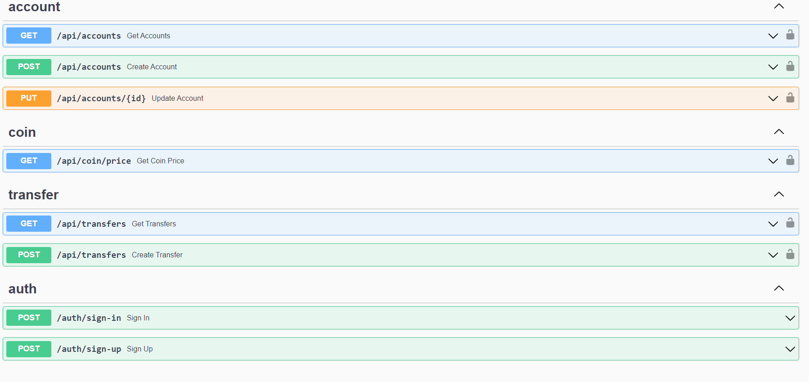

# Simple Coins app


This is a simple backend for coins app. It is a simple REST API that allows you to create, update accounts
and transfer coin between them.

## How to run

You need to have installed [Docker](https://docs.docker.com/install/) and [Docker Compose](https://docs.docker.com/compose/install/).

Then you can run the app with the following command:

```bash
make build && make run
```

## How to use

The app is available on port 8080. You can use the following endpoints:

### Accounts endpoints
- `GET /accounts` - returns all accounts
- `GET /accounts/{id}` - returns account with given id
- `POST /accounts` - creates new account
- `PUT /accounts/{id}` - updates account with given id


### Transfers endpoints
- `POST /transfers` - creates new transfer
- `GET /transfers` - returns all transfers
- `GET /transfers/{id}` - returns transfer with given id

### Coin endpoints
- `GET /coin/price` - returns current prices of coin (due to Binance API)

## Swagger documentation

You can find Swagger documentation on `swagger/index.html` endpoint.

Looks like this:


## Kafka

The app uses Kafka for simple event sourcing. You can find the topics in `docker-compose.yml` file.